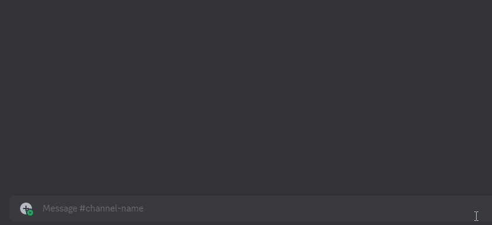
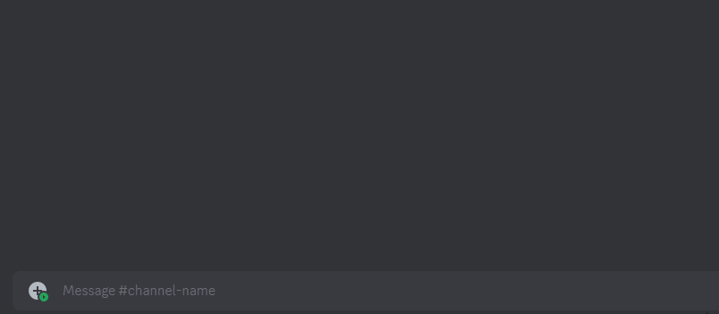
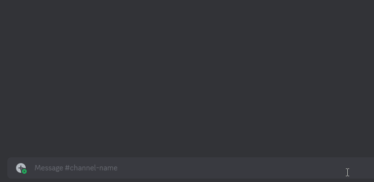
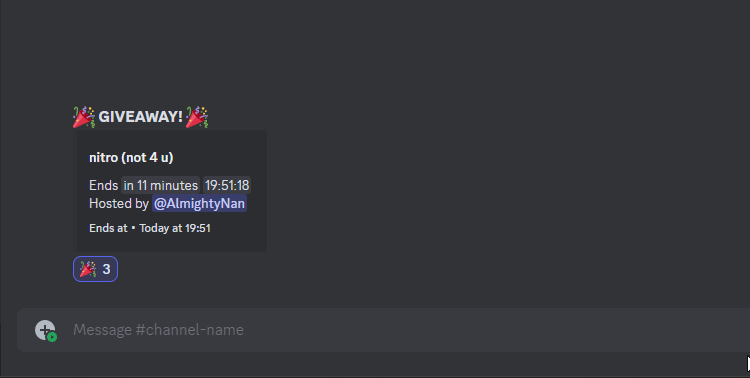
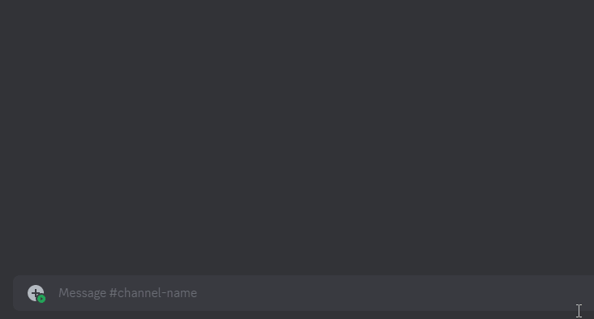

# Giveaways

### `a!wins`



* `a!wins` - Shows the number of giveaway wins in total of a user.



### `a!managerole`



* Shows/sets the current manager role used to restrict creation of giveaways to.



### `a!winrole`



* `a!winrole` - View current roles to be added to the winner of a giveaway.
* `a!winrole add <role_id / role_mention>` - Add a role as winner role.
* `a!winrole remove <role_id / role_mention>` - Removes a role from winner role.



<figure><figcaption>
a!winrole add ↗️
</figcaption></figure>

<figure><figcaption>
a!winrole remove ↗️
</figcaption></figure>



### `a!gwblacklist`



* `a!gwblacklist` - Blacklist or unblacklist someone from entering giveaways.



<figure><figcaption></figcaption></figure>



### `a!glist`



* `a!glist` - View the current list of giveaways which are running in the server.



<figure><figcaption></figcaption></figure>



### `a!gdelete`



* `a!gdelete` - Deletes a giveaway from the server and the database.



<figure><figcaption></figcaption></figure>



### `a!gend`



* `a!gend` - Ends a currently running giveaway in this server.



<figure><figcaption></figcaption></figure>



### `a!greroll`



* `a!greroll <msg_id>` - Rerolls a giveaway with a message ID (`msg_id` is optional).



<figure><figcaption></figcaption></figure>




### `a!gstart`



* `a!gstart <duration> <winners> <prize>` - Creates a giveaway in the server.



<figure><figcaption></figcaption></figure>




**Syntax usage:**

`<>` = Required argument (mandatory and must be included)

`[]` = Optional argument (not necessary to be included)

