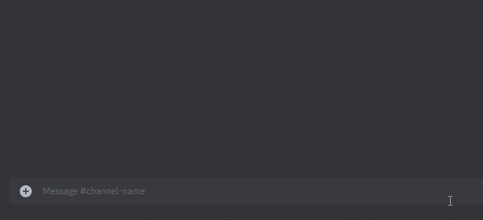
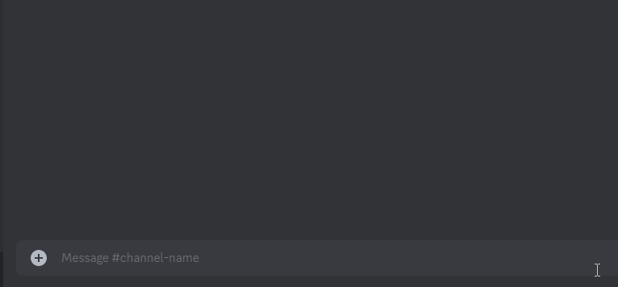
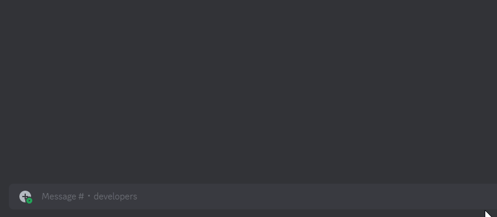
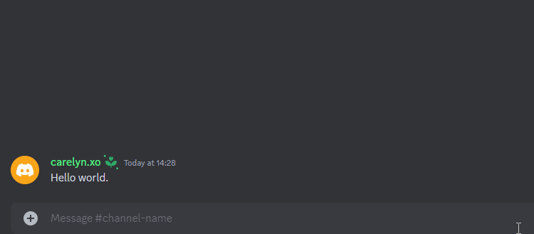
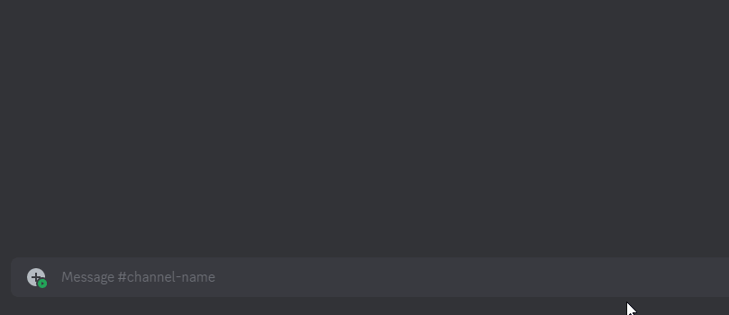
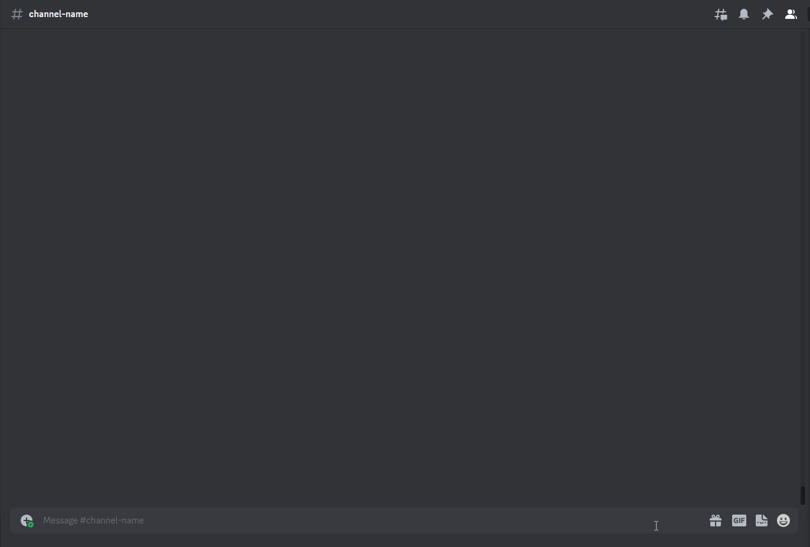
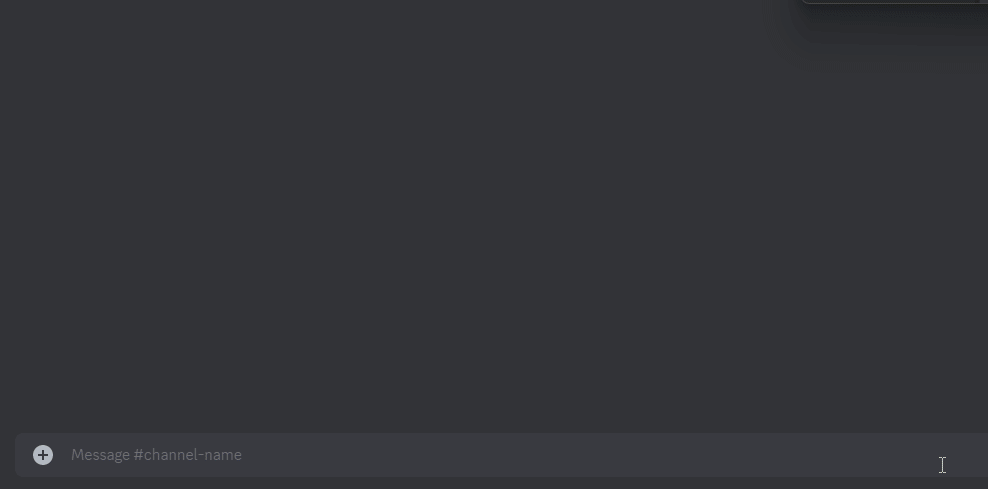
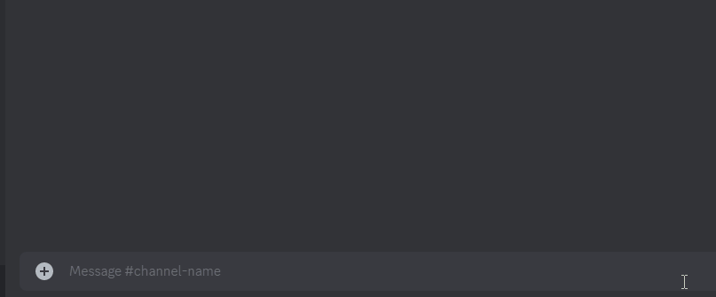
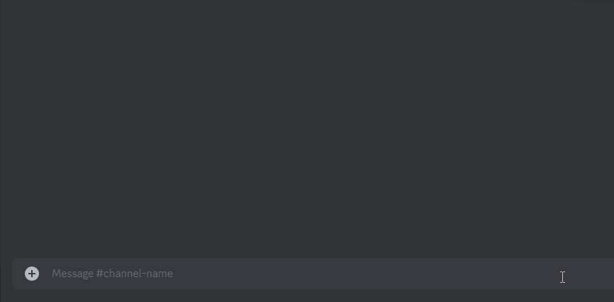
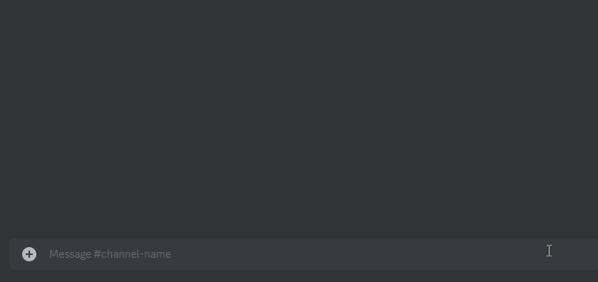

# Utilities

### `a!timer`



* `a!timer <duration> [name]` - Creates a timer with custom duration & name.



<figure><figcaption></figcaption></figure>



### `a!timestamp`



* `a!timestamp <time>` - Creates a discord formatted timestmap for a time.



<figure><figcaption></figcaption></figure>



### `a!movech`



* `a!movech <category>` - Moves a text channel to a category.



### `a!roleicon`



* `a!roleicon <role> <icon>` - Sets roleicon for a role.



<figure><figcaption></figcaption></figure>



### `a!snipe`



* `a!snipe [channel] [index]` - Retrives a deleted message.



<figure><figcaption></figcaption></figure>



### `a!snipetoggle`



* `a!snipetoggle` - Enables/disables other users from viewing your deleted messages.



<figure><figcaption></figcaption></figure>



### `a!purge`



* `a!purge <count>` - Deletes the number of specified messages from the channel.



<figure><figcaption></figcaption></figure>



### `a!nuke`



* `a!nuke [channel]` - Deletes a channel and clones it to remove all the pings.


**WARNING - DESTRUCTIVE ACTION**

`a!nuke` is a destructive action and cannot be reversed. Meaning the messages/attachments/embeds/pings from a channel cannot be restored again. Run this command only if you are sure about the damage caused by it.




<figure><figcaption></figcaption></figure>



### `a!clone`



* `a!clone` - Clones a channel without deleting the initial channel.



### `a!timedif`



* `a!timedif` - Check the time different between two messages
* For explanation, go to [time-difference.md](../guides/time-difference.md "mention")



### `a!avatar`



* `a!avatar [user]` - View your avatar or other user's avatar.



<figure><figcaption></figcaption></figure>



### `a!userinfo`



* `a!userinfo [user]` - View your info or other user's information.



<figure><figcaption></figcaption></figure>



### `a!afk`



* `a!afk [all_servers] [reason]` - Sets you as AFK.


Argument `all_servers` must be yes/no or True/False.

`all_servers` helps the bot set you AFK globally or server only.




<figure><figcaption></figcaption></figure>



### `a!clear-afk`



* `a!clear-afk <member>` - Clear the AFK status of a member (server only).



### `a!membercount`



* `a!membercount` - Shows the current membercount of the server.



### `a!embed`



* `a!embed` - Creates a new embed via the embed builder.



<figure><figcaption></figcaption></figure>



### `a!translate`



* `a!translate` - Translate a text from one language to another.



<figure><figcaption></figcaption></figure>



### `a!rename`



* `a!rename` - Rename a channel's name to something else.




**Syntax usage:**

`<>` = Required argument (mandatory and must be included)

`[]` = Optional argument (not necessary to be included)

