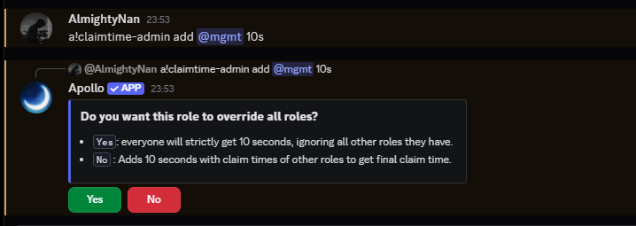

# Claimtime

## What is claimtime ?

> Whenever you host a giveaway using apollo, each user is given a set "claimtime" i.e the time that they have to claim the "set prize". Using apollo's advanced claimtime manager helps you to give extra claim time to set users/roles. In this section we will go through the details of the claimtime.
>
> Please refer to the [**overrides**](overrides.md) section if you are not familiar with it as claimtime uses overrides.

## Subcommands for the Claimtime Module

### `a!claimtime`

> This command checks the claimtime for a user or a role. It gives the claimtime for a role and it gives the total claimtime for a user.

<figure><figcaption>
claimtime for a member
</figcaption></figure>

<figure><figcaption>
claimtime for a specific role
</figcaption></figure>

### Admin commands for the Claimtime Module

### `a!claimtime-admin add` (`/claimtime-admin add`)

> This command adds or updates a specific amount of time (claimtime) to the role mentioned. Use `s` for seconds, `m` for minutes and `h` for hours.


This only works for roles and cannot be set for specific users


<figure><figcaption>
running the command will prompt you with an override selection. if you are unsure, please read our guide on <a href="overrides.md">overrides</a>
</figcaption></figure>

<figure><figcaption>
once an override has been selected, the bot will acknowledge your selection
</figcaption></figure>

### `a!claimtime-admin remove` (`/claimtime-admin remove`)

> This command removes the claimtime set for that particular role. Once this command is used on a role, the whole claimtime is deleted for that specific role completely.&#x20;

<figure><figcaption></figcaption></figure>

### `a!claimtime-admin display (/claimtime-admin display)`

> This command shows the configured claimtime for the roles in the server, however this command only shows the claimtime only for the configured roles as shown below.

<figure><figcaption></figcaption></figure>


**Syntax usage:**

`<>` = Required argument (mandatory and must be included)

`[]` = Optional argument (not necessary to be included)

