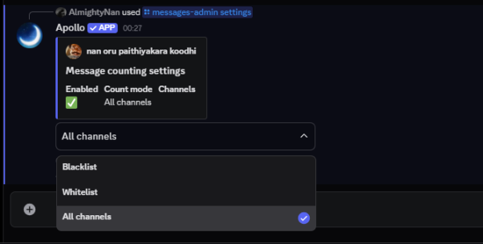

# Message Counter

## What is message counter?

> This module of apollo lets users track messages on their discord server. Apollo has a very customisable and advanced message tracking system. This module in any way does not track or store your messages in a database. You can also disable this command for yourself if you wish your messages not be counted by apollo.&#x20;

<figure><figcaption></figcaption></figure>


Message Counter is disabled by default for your server, use **a!messages enable** to start counting messages in the server.


## Subcommands for the Message Counter Module

### `a!messages (/messages)`

> This command shows the number of messages that has been sent by the user. You can also use this command to check the message sent by other users in the server too by using **a!messages {@user}** or by using **a!messages {userID}.**&#x20;

<figure><figcaption></figcaption></figure>

### Admin commands for the Claimtime Module

### `a!messages-admin <enable [or] disable>` / `/messages-admin <enable`` ``[or] disable>`

> This command helps to enable or disable the message counting feature in your server, and as mentioned above by default the message counter is off for the given server.

<figure><figcaption>
command to enable the counter
</figcaption></figure>

<figure><figcaption>
command to disable the counter
</figcaption></figure>

### `a!messages-admin settings` / `/messages-admin settings`

#### _Blacklist Mode_

> In this mode, Apollo will blacklist the given channels where the messages will not be counted. But the messages in all the other channels will be counted as usual.

<figure><figcaption>
select the dropdown and choose blacklist to enter blacklist mode
</figcaption></figure>

<figure><figcaption></figcaption></figure>

In the example shown above, we have set Apollo to ignore (blacklist) the **#rules** channel and any messages sent in that channel will not be counted. To add a channel to blacklist, just use the dropdown menu to select it.

#### _Whitelist Mode_

> In this mode, Apollo will whitelist the given channels where the messages will be counted. But the messages in all the other channels will not be counted.

<figure><figcaption>
select the dropdown and choose blacklist to enter blacklist mode
</figcaption></figure>

<figure><figcaption></figcaption></figure>

In the example shown above, we have set Apollo to only count from the **#general** channel and any messages sent in that channel **only** be counted. To add a channel to whitelist, just use the dropdown menu to select it.


You can add multiple channels to the blacklist or the whitelist.


### `a!messages-admin add` / `a!messages-admin remove`

> This command lets you add or removes messages for a particular user or yourself. Note that this feature can only used by administrators of a server.&#x20;

<figure><figcaption>
bot has added 40 messages to user
</figcaption></figure>

<figure><figcaption>
bot has removed 30 messages from the user
</figcaption></figure>


Removing messages greater than the messages a user has will reset their message count back to **zero** and not any negative integer.


### `a!messages-admin reset`

This command allows you to reset the messages of a particular user in your server.

<figure><figcaption>
bot has successfully reset message count
</figcaption></figure>

#### `a!messages-admin reset-all`

This command allows you to reset the messages of everyone in your server to **0**. The bot will ask for a confirmation before proceeding.

<figure><figcaption></figcaption></figure>

### `a!leaderboard` / `a!lb` / `/leaderboard`

This command shows the messages sent by everyone from greatest to the least. This command uses pagination so you can scroll through through multiple pages to check the message counts.

<figure><figcaption></figcaption></figure>


**Syntax usage:**

`<>` = Required argument (mandatory and must be included)

`[]` = Optional argument (not necessary to be included)

