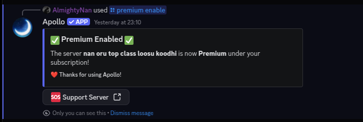

# Premium

## What is Apollo Premium? 

> Apollo Premium is an improved version of the free instance providing a lot of powerful features for premium discord servers.&#x20;


Purchase Apollo premium, go to our website at [https://apollo-bot.xyz/premium](https://apollo-bot.xyz/premium)


## How do I sign up for premium?

> 1. Head over to [https://itranslator.app/premium](https://itranslator.app/premium)
> 2. Select a plan.
> 3. Click on "Upgrade", then follow the checkout session.

## Managing Subscriptions

> Head to [https://apollo-bot.xyz/dashboard/manage-subscription](https://apollo-bot.xyz/dashboard/manage-subscription) to manage your payment method(s) or cancel your subscription. If you are looking for a refund, please join our [Discord server](https://discord.gg/dndkJfVjA3).

## Enabling Premium

> To enable, type `/premium enable` in your server.

<figure><figcaption></figcaption></figure>

> To disable, type `/premium disable` in your server.

<figure><figcaption></figcaption></figure>

> To view your premium subscription, type `/premium info` in your server.

<figure><figcaption></figcaption></figure>
